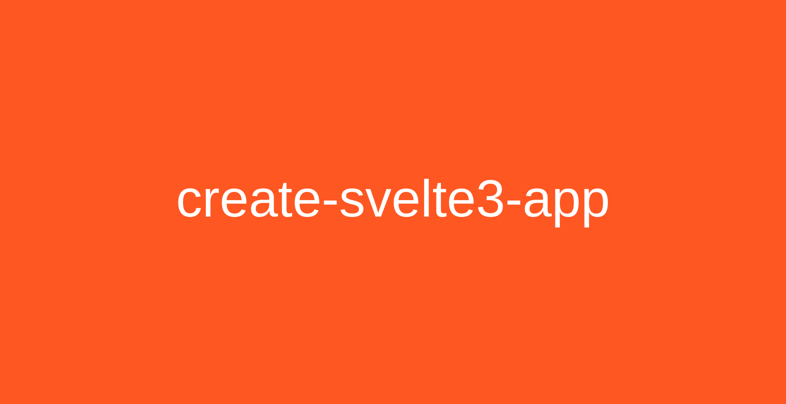

Create a configured Svelte 3 app quickly.

# create-svelte3-app

Quickly create Svelte 3 web apps configured with:

-   Typescript
-   ESLint
-   Prettier
-   Jest
-   Husky

Powered by [Vite](https://vitejs.dev).

---

[Licence (MIT)](https://github.com/IogaMaster/create-svelte3-app/blob/main/LICENCE)

